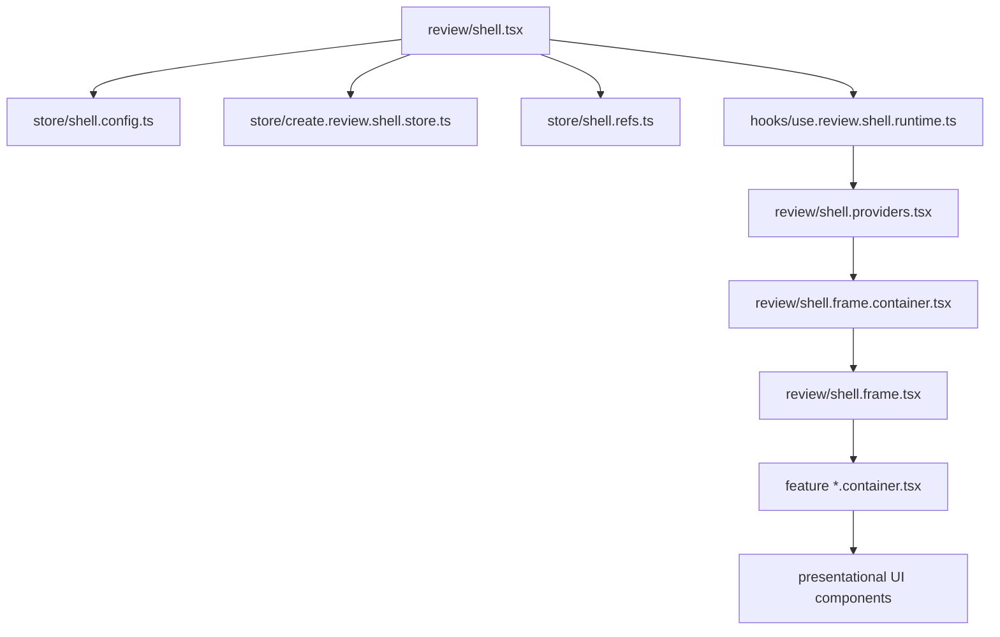
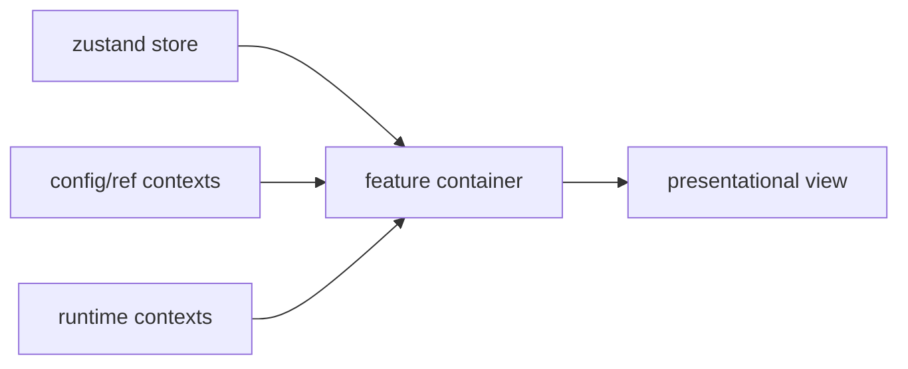

# Architecture and Runtime Logic

`df-web-review-kit` has two main runtime surfaces:

- `core`: a vanilla DOM runtime that can mount review overlays on a same-origin target page.
- `react-shell`: a React review app that hosts pages in an iframe and controls the core runtime.

This split keeps the target-page overlay independent from React while allowing the review shell to provide richer workflow UI.

## High-Level Flow

```txt
React shell
  -> renders topbar, QA panel, iframe, ruler, settings
  -> creates core runtime with createWebReviewKit()
  -> passes iframe target geometry through getReviewKitTarget()

Core runtime
  -> mounts a shadow DOM overlay
  -> handles area/DOM selection
  -> creates markers and highlights over the target viewport
  -> persists ReviewItem records through the configured adapter
```

In the React shell, core is created with:

```ts
createWebReviewKit({
  target: () => getReviewKitTarget({ frameScrollRef, iframeRef }),
  ui: {
    panel: false,
  },
});
```

`ui.panel: false` means the React shell owns the side panel and toolbar. Core still owns target overlays such as area selection boxes, DOM hover outlines, saved item markers, and highlights.

When the React shell provides a composer host, core docks DOM/area draft composer UI into the QA panel instead of rendering it as a floating target overlay. Core still owns draft creation, anchor capture, geometry, and adapter submission; React shell only provides the stable panel host.

## Core Modules

- `web.review.kit.app.ts`: controller lifecycle, state transitions, adapter calls, item creation, restore flow.
- `web.review.kit.view.ts`: thin render orchestrator. Decides which overlay layers to render and docks the draft composer into the shell panel. All DOM building lives in `view/`.
- `draft.metrics.ts`: pure geometry for draft adjustment (nudge/scale) previews, kept out of the renderer.
- `dom.anchor.ts`: selector candidate generation, anchor rebinding, text fingerprint matching.
- `geometry.ts`: target-space and host-space coordinate conversion.
- `review/item.ts`: marker, selection, highlight, and fallback resolution.
- `review/scope.ts`: viewport scope grouping and numbering.
- `review/format.ts`: compact item/draft metadata labels.
- `scroll.ts`: scroll restore helpers.
- `location.ts`: public URL and route key helpers.

### Core View Modules (`src/core/view/`)

The overlay renderer is split by role. Modules never reach into the app directly; they receive `WebReviewKitViewConfig` (options + state getter + actions) or the narrower `DraftLayerContext` defined in `view/types.ts`.

- `dom.draft.ts`: DOM draft layer — pin, highlight, composer popover, adjustment (nudge/scale) controls, pin/composer drag.
- `area.draft.ts`: area draft form, on-page selection overlay, and floating/docked composer popover.
- `selection.layers.ts`: element-pick hover layer and area drag-select layer.
- `markers.ts`: stored item marker/highlight layer.
- `panel.ts`: built-in side panel for standalone core usage (header, toolbar, item list). Disabled under the React shell.
- `form.widgets.ts`: shared draft form widgets (title input, assignee select, save/cancel actions, drag handle).
- `draft.capture.ts`: viewport capture button and capture payload builders.
- `composer.position.ts`: composer sizing/clamping and drag wiring (pure placement math).
- `draft.text.ts`: metric/adjustment display formatting and the saved-comment adjustment suffix.
- `icons.ts`: stateless SVG icon and spinner builders.

## Coordinate Spaces

Core uses two coordinate spaces:

- **Target space**: coordinates relative to the iframe or target page viewport.
- **Host space**: coordinates relative to the review shell page that contains the iframe.

Persisted review data uses target-space viewport values plus optional anchor-relative values. Rendering converts target-space markers and selections into host-space overlay positions.

## Anchor and Restore Logic

When a user creates a DOM or area item, core tries to capture:

- an explicit configured anchor such as `data-qa-id`
- common test/section attributes such as `data-testid`, `data-cy`, or `data-section-id`
- a meaningful `id`
- semantic attributes such as `aria-label`, `title`, `name`, or `href`
- a meaningful class
- a scoped DOM path from the nearest stable ancestor
- a DOM path fallback
- a short text fingerprint

Restore prefers anchor-relative coordinates because absolute viewport coordinates drift after layout changes. If an anchor cannot be resolved, core falls back to the original viewport coordinate adjusted by saved scroll position.

## Adapter Boundary

Core never owns persistence storage directly. It only calls the configured `WebReviewKitAdapter`:

- `list`
- `get`
- `create`
- `update`
- `remove`

The default local adapter is for draft/local review work. Supabase is optional host wiring, not a required backend. Figma reference images use a separate `ReviewFigmaImageStore`; see [Adapter boundaries](adapters.md).

## React Shell Boundary

`react-shell` owns reviewer workflow UI:

- iframe target routing
- QA list and item actions
- viewport presets
- sitemap modal
- settings modal
- ruler UI
- presence UI
- host overlay toggles such as grid and Figma
- Source Tree UI, metadata toggles, and browser-local UI state persistence
- QA panel composer host for shell-owned layout

React shell should call the core controller instead of duplicating target overlay logic.

### React Shell Runtime Map

`review/shell.tsx` is the React shell entrypoint. It creates instance-scoped
config, refs, and zustand store objects, then delegates runtime wiring and layout
assembly to smaller modules.



The store is created once per mounted `ReviewShell` instance. There is no
module-level shell store, so a host app using zustand does not share this state.

### State Ownership

| Layer | Files | Owns |
|---|---|---|
| Shell config | `store/shell.config.ts` | Normalized props and mostly static shell options |
| Shell refs | `store/shell.refs.ts` | iframe, frame scroll, controller, and one-shot pending refs |
| Zustand store | `store/*.slice.ts` | Target, QA, side panel, and local UI state |
| Runtime hooks | `hooks/use.review.shell.*`, feature hooks | Effects, adapter refresh, core controller wiring, and action composition |
| Runtime contexts | `review/shell.providers.tsx`, `*.context.tsx` | Non-store controllers consumed by feature containers |
| Containers | `*.container.tsx` | Read store/context and bind actions to views |
| Presentational views | non-container `.tsx` components | Render UI from explicit props |

### Container Pattern

Feature UI should not receive long prop chains from `ReviewShell`. Containers
read the closest state source directly, then pass only render-ready props to
presentational components.



When adding shell behavior, prefer this flow:

1. Put persistent UI state in the matching zustand slice.
2. Put instance config in `shell.config.ts`.
3. Put DOM/controller refs in `shell.refs.ts`.
4. Put side effects and adapter/core orchestration in a focused hook.
5. Expose cross-feature commands through `ReviewShellActions` only when multiple
   containers need the same command.

### Shell Hook Decomposition

`hooks/use.review.shell.runtime.ts` is the runtime assembler. It composes smaller
hooks and returns provider values; it should not become a render component.

- `hooks/use.review.shell.state.ts`: bridge from zustand/config/refs into runtime hook inputs.
- `hooks/use.review.shell.data.ts`: item list, filters, counts, target URL, and derived view data.
- `hooks/use.review.shell.refresh.ts`: adapter refresh for current route and sitemap counts.
- `hooks/use.review.shell.effects.ts`: shell-level effects such as pending restore, frame recentering, and Figma pointer lock.
- `hooks/use.review.shell.runtime.actions.ts`: local command builders for transient UI, mode, panels, and iframe load.
- `hooks/use.review.shell.actions.value.ts`: final `ReviewShellActions` context value.
- `hooks/use.review.controller.ts`: core runtime wiring (init/reload/restore/mode).
- `hooks/use.review.item.actions.ts`: QA item mutations and prompt/link copy actions.
- `hooks/use.review.side.panel.ts`: side panel selection, availability fallback, and browser-local persistence.
- `hooks/use.review.target.navigation.ts`: address parsing, page/source switching, selected-item clearing, and shell URL sync.
- `hooks/use.review.source.inspector.ts`: source inspector state and target-iframe shortcut binding.
- `hooks/use.review.section.outline.ts`: Source Tree outline extraction, filter/collapse state, refresh scheduling, and entry actions.
- `hooks/use.review.command.key.ts`: hide-all-overlays-while-command-held tracking across host and iframe.

### Sitemap Feature Boundary

Sitemap state and row derivation are intentionally separate:

- `sitemap/modal.tsx`: owns search, sort, status filters, and collapsed-folder UI state.
- `sitemap/tree.ts`: converts the page list into visible tree or flat result rows.
- `sitemap/count.ts`: owns the QA count shape, viewport column keys, and count aggregation.
- `sitemap/row.tsx`: renders the shared page, folder, and All QA row content.

The modal mounts on first open and is hidden instead of unmounted on close. This
preserves search, sort, collapsed folders, active status filters, and scroll
position while the review shell remains mounted.

Page rows show only that page's direct QA count. Folder rows aggregate their
descendant pages. Enabled status filters use OR with each other and AND with the
search query; while status filtering is active, only matching pages are shown
as flat full paths so a parent folder aggregate cannot look like a match.

### Comment Policy

Prefer comments only at module boundaries or non-obvious runtime contracts. Avoid
file-wide restatements of import names, prop-by-prop explanations, or comments
that duplicate what a function name already says.

## Figma Image Feature Boundary

Figma overlay work should stay outside core unless it needs target runtime primitives.

Current ownership:

```txt
src/react-shell/figma/
  image.controller.ts          # image store list and mutations
  image.overlay.controller.ts  # React effects and overlay commands
  image.overlay.state.ts       # route-keyed localStorage and migration
  images.panel*.tsx            # shell panel UI

src/react-shell/target/
  figma.image.overlay.ts       # iframe DOM rendering and drag behavior

src/figma/
  image.types.ts               # public image/store contracts
```

`image.overlay.controller.ts` re-exports the overlay types used by existing
shell modules, but persistence and normalization live in
`image.overlay.state.ts`. Keep storage migrations and default-value cleanup out
of the React controller.

Shared coordinate math can reuse `core/geometry.ts` or move to a future shared module if both core and Figma need it heavily.

Avoid turning `core` into a feature bucket. Core should stay focused on target review runtime behavior.

## Extension Rules

- Put target overlay primitives in `core`.
- Put reviewer workflow UI in `react-shell`.
- Put feature-specific integration logic, such as Figma matching, in its own module.
- Keep adapter contracts storage-agnostic.
- Prefer anchor-relative data for anything that must survive layout changes.
