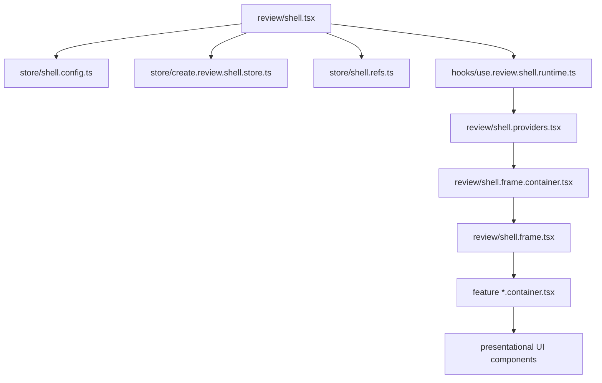
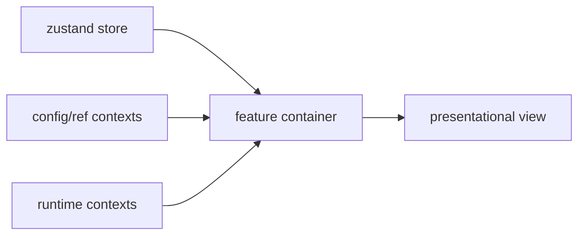

# Architecture and Runtime Logic

`df-web-review-kit` has two main runtime surfaces:

- `core`: a vanilla DOM runtime that can mount review overlays on a same-origin target page.
- `react-shell`: a React review app that hosts pages in an iframe and controls the core runtime.

This split keeps the target-page overlay independent from React while allowing the review shell to provide richer workflow UI.

For file conventions, feature ownership, and the current-to-planned path map,
see [File Naming and Feature Ownership](file-naming.md). The runtime paths below
describe the current implementation; only destinations marked implemented in
the naming map are completed moves.

## High-Level Flow

```txt
React shell
  -> renders topbar, QA panel, iframe, ruler, settings
  -> creates core runtime with createWebReviewKit()
  -> passes iframe target geometry through getReviewKitTarget()

Core runtime
  -> mounts a shadow DOM overlay
  -> handles area/DOM selection
  -> creates markers and highlights over the target viewport
  -> persists ReviewItem records through the configured adapter
```

In the React shell, core is created with:

```ts
createWebReviewKit({
  target: () => getReviewKitTarget({ frameScrollRef, iframeRef }),
  ui: {
    panel: false,
  },
});
```

`ui.panel: false` means the React shell owns the side panel and toolbar. Core still owns target overlays such as area selection boxes, DOM hover outlines, saved item markers, and highlights.

When the React shell provides a composer host, core docks DOM/area draft composer UI into the QA panel instead of rendering it as a floating target overlay. Core still owns draft creation, anchor capture, geometry, and adapter submission; React shell only provides the stable panel host.

## Core Modules

- `web.review.kit.app.ts`: controller lifecycle, state transitions, adapter calls, item creation, restore flow.
- `web.review.kit.view.ts`: thin render orchestrator. Decides which overlay layers to render and docks the draft composer into the shell panel. All DOM building lives in `view/`.
- `draft.metrics.ts`: pure geometry for draft adjustment (nudge/scale) previews, kept out of the renderer.
- `dom.anchor.ts`: selector candidate generation, anchor rebinding, text fingerprint matching.
- `geometry.ts`: target-space and host-space coordinate conversion.
- `overlay.style.ts`: ordered stylesheet assembly from `style/overlay.base.ts`,
  `style/overlay.markers.ts` and `style/overlay.draft.ts`; interleaved fragments
  preserve the original cascade and responsive override positions.
- `review/item.ts`: marker, selection, highlight, and fallback resolution.
- `review/item.payload.ts`: pure item field normalization from form data and explicit persistence/environment snapshots.
- `review/draft.attachments.ts`: manual capture conversion and required-upload / best-effort-auto-capture operations. Uses `review/capture.input.ts`; no app state ownership.
- `review/draft.builder.ts`: existing DOM/area draft geometry builders. App retains draft state, loading guards, preview disposal and save lifecycle.
- `review/scope.ts`: viewport scope grouping and numbering.
- `review/format.ts`: compact item/draft metadata labels.
- `scroll.ts`: scroll restore helpers.
- `location.ts`: public URL and route key helpers.

### Core View Modules (`src/core/view/`)

The overlay renderer is split by role. Modules never reach into the app directly; they receive `WebReviewKitViewConfig` (options + state getter + actions) or the narrower `DraftLayerContext` defined in `view/types.ts`.

- `dom.draft.ts`: DOM draft layer — pin, highlight, composer popover, adjustment (nudge/scale) controls, pin/composer drag.
- `area.draft.ts`: area draft form, on-page selection overlay, and floating/docked composer popover.
- `selection.layers.ts`: element-pick hover layer and area drag-select layer.
- `markers.ts`: stored item marker/highlight layer.
- `panel.ts`: built-in side panel for standalone core usage (header, toolbar, item list). Disabled under the React shell.
- `form.widgets.ts`: shared draft form widgets (title input, assignee select, save/cancel actions, drag handle).
- `draft.capture.ts`: viewport capture button and capture payload builders.
- `composer.position.ts`: composer sizing/clamping and drag wiring (pure placement math).
- `draft.text.ts`: metric/adjustment display formatting and the saved-comment adjustment suffix.
- `icons.ts`: stateless SVG icon and spinner builders.

## Design Inspector Rendering Boundary

The CSS Design Inspector remains separate from Source Tree selection:

- `src/design-inspector/inspector.ts`: selection, mode, snapshot reads, source
  request lifecycle, frame scheduling, document rebinding and session cleanup.
- `src/design-inspector/target.events.ts`: one target document's event binding
  and listener cleanup. Reads current pick mode/selection through callbacks and
  delegates state changes to explicit controller commands; it owns no selection.
- `src/design-inspector/panel.view.ts`: static panel DOM, summary/CSS detail rows,
  measurement rows, and detail-scroll preservation. Receives the current snapshot,
  tab and search text; it does not own selection or source requests.
- `src/design-inspector/geometry.view.ts`: overlay host, clipping, projected boxes,
  measurement lines and viewport-fitted labels. Receives rectangles, guides and
  current frame geometry; it does not read target elements or own target state.
- `src/design-inspector/dom.ts`: shared text-node creation using `textContent`.

The controller still batches target DOM reads before overlay writes, and label
fitting still batches its own label reads before position writes. Both views use
the existing stylesheet; selectors, markup, model/snapshot helpers and projection
math remain unchanged. The controller mounts and removes both hosts.

On document changes, the controller calls the previous target cleanup before
resetting selection, disconnecting selection observers and invalidating pending
source results. It then binds the new document. Destroy also releases target,
host, viewport and font listeners and disconnects observers. Source promises are
not forcibly aborted: existing request IDs reject stale results/open requests.
No event bus or second state owner is introduced.

## Coordinate Spaces

Core uses two coordinate spaces:

- **Target space**: coordinates relative to the iframe or target page viewport.
- **Host space**: coordinates relative to the review shell page that contains the iframe.

Persisted review data uses target-space viewport values plus optional anchor-relative values. Rendering converts target-space markers and selections into host-space overlay positions.

## Anchor and Restore Logic

When a user creates a DOM or area item, core tries to capture:

- an explicit configured anchor such as `data-qa-id`
- common test/section attributes such as `data-testid`, `data-cy`, or `data-section-id`
- a meaningful `id`
- semantic attributes such as `aria-label`, `title`, `name`, or `href`
- a meaningful class
- a scoped DOM path from the nearest stable ancestor
- a DOM path fallback
- a short text fingerprint

Restore prefers anchor-relative coordinates because absolute viewport coordinates drift after layout changes. If an anchor cannot be resolved, core falls back to the original viewport coordinate adjusted by saved scroll position.

## Adapter Boundary

Core never owns persistence storage directly. It only calls the configured `WebReviewKitAdapter`:

- `list`
- `get`
- `create`
- `update`
- `remove`

The default local adapter is for draft/local review work. Supabase is optional host wiring, not a required backend. Figma reference images use a separate `ReviewFigmaImageStore`; see [Adapter boundaries](adapters.md).

## React Shell Boundary

`react-shell` owns reviewer workflow UI:

- iframe target routing
- QA list and item actions
- viewport presets
- sitemap modal
- settings modal
- ruler UI
- presence UI
- host overlay toggles such as grid and Figma
- Source Tree UI, metadata toggles, and browser-local UI state persistence
- QA panel composer host for shell-owned layout

React shell should call the core controller instead of duplicating target overlay logic.

### React Shell Runtime Map

`review/shell.tsx` is the React shell entrypoint. It creates instance-scoped
config, refs, and zustand store objects, then delegates runtime wiring and layout
assembly to smaller modules.


```mermaid
flowchart TD
  Shell["review/shell.tsx"]
  Config["store/shell.config.ts"]
  Store["store/create.review.shell.store.ts"]
  Refs["store/shell.refs.ts"]
  Runtime["hooks/use.review.shell.runtime.ts"]
  Providers["review/shell.providers.tsx"]
  FrameContainer["review/shell.frame.container.tsx"]
  Frame["review/shell.frame.tsx"]
  Containers["feature *.container.tsx"]
  Views["presentational UI components"]

  Shell --> Config
  Shell --> Store
  Shell --> Refs
  Shell --> Runtime
  Runtime --> Providers
  Providers --> FrameContainer
  FrameContainer --> Frame
  Frame --> Containers
  Containers --> Views
```

The store is created once per mounted `ReviewShell` instance. There is no
module-level shell store, so a host app using zustand does not share this state.

### State Ownership

| Layer | Files | Owns |
|---|---|---|
| Shell config | `store/shell.config.ts` | Normalized props and mostly static shell options |
| Shell refs | `store/shell.refs.ts` | iframe, frame scroll, controller, and one-shot pending refs |
| Zustand store | `store/*.slice.ts` | Target, QA, side panel, and local UI state |
| Runtime hooks | `hooks/use.review.shell.*`, feature hooks | Effects, adapter refresh, core controller wiring, and action composition |
| Runtime contexts | `review/shell.providers.tsx`, `*.context.tsx` | Non-store controllers consumed by feature containers |
| Containers | `*.container.tsx` | Read store/context and bind actions to views |
| Presentational views | non-container `.tsx` components | Render UI from explicit props |

### Container Pattern

Feature UI should not receive long prop chains from `ReviewShell`. Containers
read the closest state source directly, then pass only render-ready props to
presentational components.


```mermaid
flowchart LR
  Store["zustand store"]
  Config["config/ref contexts"]
  RuntimeContext["runtime contexts"]
  Container["feature container"]
  View["presentational view"]

  Store --> Container
  Config --> Container
  RuntimeContext --> Container
  Container --> View
```

When adding shell behavior, prefer this flow:

1. Put persistent UI state in the matching zustand slice.
2. Put instance config in `shell.config.ts`.
3. Put DOM/controller refs in `shell.refs.ts`.
4. Put side effects and adapter/core orchestration in a focused hook.
5. Expose cross-feature commands through `ReviewShellActions` only when multiple
   containers need the same command.

### Shell Hook Decomposition

`hooks/use.review.shell.runtime.ts` is the runtime assembler. It composes smaller
hooks and returns provider values; it should not become a render component.

- `hooks/use.review.shell.state.ts`: bridge from zustand/config/refs into runtime hook inputs.
- `hooks/use.review.shell.data.ts`: item list, filters, counts, target URL, and derived view data.
- `hooks/use.review.shell.refresh.ts`: adapter refresh for current route and sitemap counts.
- `hooks/use.review.shell.effects.ts`: shell-level effects such as pending restore, frame recentering, and Figma pointer lock.
- `hooks/use.review.shell.runtime.actions.ts`: local command builders for transient UI, mode, panels, and iframe load.
- `hooks/use.review.shell.actions.value.ts`: final `ReviewShellActions` context value.
- `hooks/use.review.controller.ts`: core runtime wiring (init/reload/restore/mode).
- `hooks/use.review.item.actions.ts`: QA item mutations and prompt/link copy actions.
- `hooks/use.review.side.panel.ts`: side panel selection, availability fallback, and browser-local persistence.
- `hooks/use.review.target.navigation.ts`: address parsing, page/source switching, selected-item clearing, and shell URL sync.
- `source-tree/`: Source Tree model, source selection, panels, overlays and dedicated tests. Shared shell orchestration stays in `hooks/` and layout assembly in `review/`; CSS Design Inspector remains separate.
- `source-tree/use.source.inspector.ts`: source inspector React state and target-iframe shortcut lifecycle; `source-tree/source.selection.events.ts` owns listener binding and `source-tree/source.font.overlay.ts` owns font-hint DOM/styles.
- `source-tree/use.section.outline.ts`: Source Tree snapshot/collapse policy, filter/selection state and entry/QA actions; `source-tree/use.outline.observation.ts` handles document scanning and refresh lifecycle.
- `hooks/use.review.command.key.ts`: hide-all-overlays-while-command-held tracking across host and iframe.

### Sitemap Feature Boundary

Sitemap state and row derivation are intentionally separate:

- `sitemap/modal.tsx`: owns search, sort, status filters, and collapsed-folder UI state.
- `sitemap/tree.ts`: converts the page list into visible tree or flat result rows.
- `sitemap/count.ts`: owns the QA count shape, viewport column keys, and count aggregation.
- `sitemap/row.tsx`: renders the shared page, folder, and All QA row content.

The modal mounts on first open and is hidden instead of unmounted on close. This
preserves search, sort, collapsed folders, active status filters, and scroll
position while the review shell remains mounted.

Page rows show only that page's direct QA count. Folder rows aggregate their
descendant pages. Enabled status filters use OR with each other and AND with the
search query; while status filtering is active, only matching pages are shown
as flat full paths so a parent folder aggregate cannot look like a match.

### Comment Policy

Prefer comments only at module boundaries or non-obvious runtime contracts. Avoid
file-wide restatements of import names, prop-by-prop explanations, or comments
that duplicate what a function name already says.

## Figma Image Feature Boundary

Figma overlay work should stay outside core unless it needs target runtime primitives.

Current ownership:

```txt
src/react-shell/figma/
  use.image.store.ts          # image store list and mutations
  use.image.overlay.ts  # React effects and overlay commands
  image.overlay.state.ts       # route-keyed localStorage and migration
  images.panel*.tsx            # shell panel UI

src/react-shell/target/
  figma.image.overlay.ts       # iframe DOM rendering and drag behavior

src/figma/
  image.types.ts               # public image/store contracts
```

`use.image.overlay.ts` re-exports the overlay types used by existing
shell modules, but persistence and normalization live in
`image.overlay.state.ts`. Keep storage migrations and default-value cleanup out
of the React controller.

Shared coordinate math can reuse `core/geometry.ts` or move to a future shared module if both core and Figma need it heavily.

Shared Figma helpers now live in `src/figma/image.asset.ts` (MIME, formats and
storage keys) and `src/figma/image.target.ts` (normalized store keys and legacy
overlay keys). The two key formats remain distinct for persisted-data compatibility.
The default store endpoint lives with existing defaults/contracts in
`src/figma/image.types.ts`. The client store preserves its existing public
re-exports; Vite imports shared helpers directly, not through the client store.
Server-only asset pathname decoding and request routing stay under `src/vite/`.
Panel helpers import overlay defaults/types from `image.overlay.state.ts`, which
no longer imports a React controller for key construction.

Avoid turning `core` into a feature bucket. Core should stay focused on target review runtime behavior.

## Extension Rules

- Put target overlay primitives in `core`.
- Put reviewer workflow UI in `react-shell`.
- Put feature-specific integration logic, such as Figma matching, in its own module.
- Keep adapter contracts storage-agnostic.
- Prefer anchor-relative data for anything that must survive layout changes.

### Figma import and preview ownership

`react-shell/figma/images.import.tsx` owns URL/file import interaction state;
`image.preview.tsx` owns the existing image preview modal. `images.panel.tsx`
keeps list/layer controls and preview selection. The import component's children
slot preserves form → selected controls → error status DOM order without adding
a wrapper. Store mutation contracts and controller/container ownership stay intact.

`figma/image.row.tsx` owns the row view and shared row-editing hook;
`figma/use.image.reorder.ts` owns drag state and pointer handlers. Both hooks are
mounted once by the panel so only one rename/drag session exists across rows.
Opacity/offset/preview selection and mutation callback contracts stay at panel scope.

Style ownership: custom-panel container rules live in
`react-shell/custom-panels/style.ts`, composed immediately before QA styles in
`react-shell/style.ts`. The standalone Figma widget imports its shadow-root CSS
from `react-shell/figma/dev.overlay.style.ts`. These are ownership-only changes;
selectors, tokens, z-index values and emitted style order remain unchanged.

## Vite Locator Modules

`src/vite.ts` remains the package entry, re-exporting the source/data locator
plugins, their option types and the existing Figma store API. Internal ownership:

- `vite/source.locator.ts` / `data.locator.ts`: plugin hooks and orchestration.
- `vite/locator.options.ts`: shared options, path matching and source environment replacement.
- `vite/locator.transform.ts`: optional TypeScript loader and line-preserving JSX AST insertion.
- `vite/jsx.runtime.ts`: generated JSX development runtime; its serialized helpers remain self-contained.

Serve/build activation and editor-link gates remain in the existing
`vite/review-locator.mode.ts`. Figma storage/server modules are unchanged.

## df-sheet Integration Modules

The public `src/df-sheet.ts` entry re-exports its existing API from:

- `df-sheet/session.ts`: PKCE authorization/callback, cached browser session,
  selected-page validation, authenticated client assembly, disconnect and logout.
- `df-sheet/http.ts`: JSON envelopes, bearer headers, multipart handling and
  the exported `DfSheetReviewSessionExpiredError` class.
- `df-sheet/adapter.ts`: QA list/get/create/update/remove and attachment upload;
  each adapter still owns its own in-flight list map and last-item cache.
- `df-sheet/types.ts`: the existing public contracts shared by those modules.

Session owns authentication and calls HTTP and adapter modules; the adapter
receives an authenticated request callback. No internal module imports the
public entry, and there is no new session manager or duplicate state owner.

## Structural review handoff — 2026-09-12

Sequence 8 compares `dab969b` (v0.12.0 review baseline) with `70bd8ab`
(steps 01–14 implemented). Step 15 adds verification/documentation only.
Counts exclude tests, dev fixtures, dependencies and generated output; physical
lines include comments, blank lines and embedded CSS/runtime templates.

| Inventory | Before | After |
|---|---:|---:|
| Production TS/TSX files | 222 | 250 |
| Physical source lines | 44,229 | 44,601 |
| Files ≥500 lines | 23 | 16 |
| Files ≥800 lines | 6 | 4 |
| Files >1,000 lines | 2 | 1 |

This is responsibility separation, not net code deletion: imports and explicit
module boundaries add 372 lines. No line budget is enforced.

| Responsibility / current path | Before | After |
|---|---:|---:|
| `design-inspector/inspector.ts` | 779 | 489 |
| `react-shell/source-tree/use.source.inspector.ts` | 648 | 379 |
| `react-shell/source-tree/use.section.outline.ts` | 635 | 560 |
| `react-shell/figma/images.panel.tsx` | 741 | 343 |
| `react-shell/figma/dev-overlay.tsx` | 819 | 495 |
| `core/web.review.kit.app.ts` | 934 | 847 |
| `core/overlay.style.ts` | 1,244 | 19 |
| `vite.ts` | 679 | 4 |
| `df-sheet.ts` | 539 | 11 |

The old Source Tree hook paths are mapped in [File naming](file-naming.md).
All 20 whole-file destinations exist and old paths are absent. Of 28 planned
extraction destinations, 27 exist. The optional recursive entry component was
intentionally not extracted: it would increase prop forwarding without reducing
ownership complexity. Additional shared `df-sheet/types.ts` contains only the
existing public types.

### Compatibility and remaining work

- Six public library entries retain all 196 exported declaration records and
  63 runtime export names across baseline ESM and current ESM/CJS builds.
  Generated chunk filenames/declaration ordering may differ. `package.json`
  exports/bin/dependency configuration is unchanged; this is not a new release.
- Core, shell and Figma widget stylesheet output is byte-identical to baseline.
- State owners remain in app/controller/hooks. DOM rendering, document event
  binding, observation scheduling, import/row/reorder UI, payload/attachments,
  transport and locator internals have focused homes.
- `dom.anchor.ts` (826), target capture fallbacks (591), and Vite image storage
  (image 598) remain watchlist candidates. Core app orchestration (847) and
  large cohesive styles such as QA panel (1,226) are not automatic split tasks.
- `target/target.ts` naming and source-candidate/editor splitting remain deferred.
  Todo 766 (package split) and release todos were not changed or marked done.
- See [Testing](testing.md#sequence-8-final-regression--2026-09-12) for test
  environment failures, browser observations and verification limits. Agent
  completion is a review handoff, not human approval or a release gate waiver.
